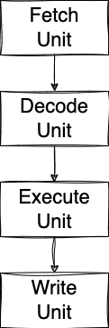
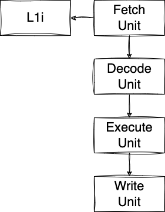
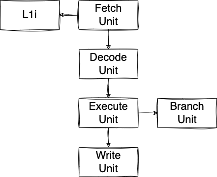
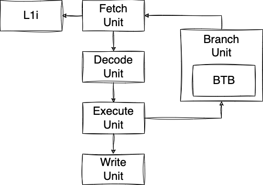

# Majorana

[Majorana](https://en.wikipedia.org/wiki/Ettore_Majorana) is a RISC-V virtual machine, written in Go.

## Majorana Virtual Machine (MVM)

### MVM-1

MVM-1 is the first version of the RISC-V virtual machine.
It does not implement any of the known CPU optimizations such as pipelining, out-of-order execution, multiple execution units, etc.

Here is the architecture, divided into 4 classic stages:
* Fetch: fetch an instruction from the main memory
* Decode: decode the instruction
* Execute: execute the RISC-V instruction
* Write: write-back the result to a register or the main memory



## MVM-2

Compared to MVM-1, we add a cache for instructions called L1I (Level 1 Instructions) with a size of 64 KB. The caching policy is straightforward: as soon as we meet an instruction that is not present in L1I, we fetch a cache line of 64 KB instructions from the main memory, and we cache it into LI1.



## MVM-3

MVM-3 keeps the same architecture than MVM-2 with 4 stages and L1I. Yet, this version implements [pipelining](https://en.wikipedia.org/wiki/Instruction_pipelining).

In a nutshell, pipelining allows keeping every stage as busy as possible. For example, as soon as the fetch unit has fetched an instruction, it will not wait for the instruction to be decoded, executed and written. It will fetch another instruction straight away during the next cycle(s).

This way, the first instruction can be executed in 4 cycles (assuming the fetch is done from L1I), whereas the next instructions will be executed in only 1 cycle.

One of the complexity with pipelining is to handle conditional branches. What if we fetch a [bge](https://msyksphinz-self.github.io/riscv-isadoc/html/rvi.html#bge) instruction for example? The next instruction fetched will not be necessarily the one we should have fetched/decoded/executed/written. As a solution, we implemented the first version of branch prediction handled by the Branch Unit.

The Branch Unit takes the hypothesis that a condition branch will **not** be taken. Hence, after having fetched an instruction, regardless if it's a conditional branch, we will fetch the next instruction after it. If the prediction was wrong, we need to flush the pipeline, revert the program counter to the destination marked by the conditional branch instruction, and continue the execution.

Of course, pipeline flushing has an immediate performance impact. Modern CPUs have a branch prediction mechanism that is more evolved than MVM-3.

There is another problem with pipelining. We might face what we call a data hazard. For example:
```
addi t1, zero, 2
div t1, t0, t1
``` 

The processor must wait for `ADDI` to be executed and to get its result written in T1 before to execute `DIV` (as div depends on T1).
In this case, we implement what we call pipeline interclock by delaying the execution of `DIV`.



## MVM-4

One issue I realized with MVM-3 is when it met a nonconditional branches. For example:

```asm
main:
  jal zero, foo # Branch to foo
  addi t1, t0, 3 # Set $t1 to $t0 + 3
foo:
  addi t0, zero, 2 # Set $t0 to 2
  ...
```

In this case, the fetch unit after fetching the first line (`jal`) was fetching the second line (first `addi`) which ends up being a problem because the execution is branching to line 3 (second `addi`). I resolved that by flushing the whole pipeline which is very costly.

The architecture of MVM-4 is very similar to MVM-3 except that the Branch Unit is now coupled with a Branch Target Buffer (BTB):



One the fetch unit fetches a branch, it doesn't know whether it's a branch; it's the job of the decode unit. Therefore, the fetch unit can't simply say: "_I fetched a branch, I'm going to wait for the Execute Unit to tell me the next instruction to fetch_".

The workflow is now the following:
- The fetch unit fetches an instruction.
- The decode unit decodes it. If it's a branch, it waits until the target program counter has been resolved by the execute unit.
- When the execute unit resolves the target address of the branch, it notifies the branch unit with the target address.
- Then, the branch unit notifies the fetch unit which invalidates the latest instruction fetched. The reason why the fetch unit fetched a wrong address is that the fetch unit by itself doesn't know whether it fetched a branch, therefore after having fetched a branch, it will fetch the next instruction during the next cycle. This instruction isn't sent to the decode unit as after havind decoded it was a branch, it puts itself in stall mode for a few cycles, waiting for the branch address to be resolved..

## Benchmarks

All the benchmarks are executed at a fixed CPU clock frequency: 2.3 GHz.

Meanwhile, we have executed a benchmark on an Intel i5-7360U (same CPU clock frequency). This benchmark was on a different architecture, different ISA, etc. is hardly comparable with the MVM benchmarks. Yet, it gives us a vague reference to show how good (or bad :) the MVM implementations are.

### Is Prime Number

RISC source: [prime-number.asm](res/risc/prime-number.asm)

|Machine|            n=1109             |
|:--------:|:-----------------------------:|
|i5-7360U|            253 ns             |
|MVM-1| 64100 ns, ~253.4 times slower |
|MVM-2|  4939 ns, ~19.5 times slower  |
|MVM-3|  3007 ns, ~11.9 times slower  |
|MVM-4|  2766 ns, ~10.9 times slower  |
