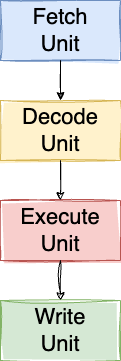
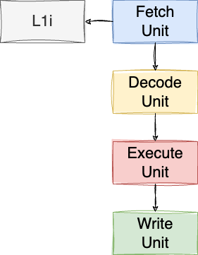
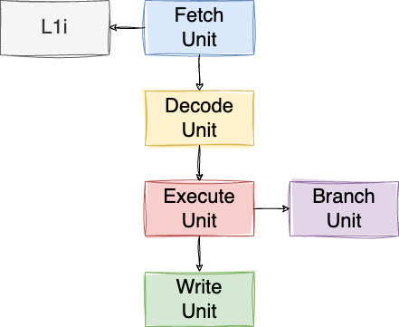
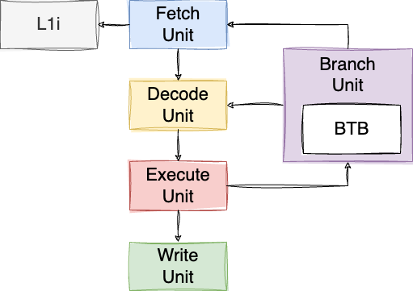
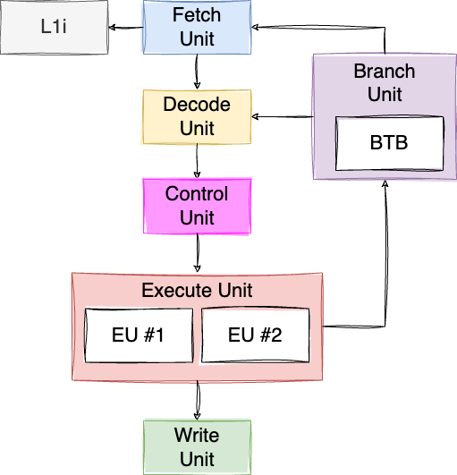

# Majorana

[Majorana](https://en.wikipedia.org/wiki/Ettore_Majorana) is a RISC-V virtual processor written in Go.

## Majorana Virtual Processor (MVP)

### MVP-1

MVP-1 is the first version of the RISC-V virtual machine.
It does not implement any of the known CPU optimizations, such as pipelining, out-of-order execution, multiple execution units, etc.

Here is the microarchitecture, divided into 4 classic stages:
* Fetch: fetch an instruction from the main memory
* Decode: decode the instruction
* Execute: execute the RISC-V instruction
* Write: write-back the result to a register or the main memory



## MVP-2

Compared to MVP-1, we add a cache for instructions called L1I (Level 1 Instructions) with a size of 64 KB. The caching policy is straightforward: as soon as we meet an instruction that is not present in L1I, we fetch a cache line of 64 KB instructions from the main memory, and we cache it into LI1.



## MVP-3

MVP-3 keeps the same microarchitecture as MVP-2 with 4 stages and L1I. Yet, this version implements [pipelining](https://en.wikipedia.org/wiki/Instruction_pipelining).

In a nutshell, pipelining allows keeping every stage as busy as possible. For example, as soon as the fetch unit has fetched an instruction, it will not wait for the instruction to be decoded, executed and written. It will fetch another instruction straight away during the next cycle(s).

This way, the first instruction can be executed in 4 cycles (assuming the fetch is done from L1I), whereas the next instructions will be executed in only 1 cycle.

One of the complexity with pipelining is to handle branches. What if we fetch a [bge](https://msyksphinz-self.github.io/riscv-isadoc/html/rvi.html#bge) instruction for example? The next instruction fetched will not be necessarily the one we should have fetched/decoded/executed/written. As a solution, we implemented the first version of branch prediction handled by the branch unit.

The branch unit takes the hypothesis that a conditional branch will **not** be taken. Hence, after having fetched an instruction, regardless if it's a conditional branch, we will fetch the next instruction after it. If the prediction was wrong, we need to flush the pipeline, revert the program counter to the destination marked by the conditional branch instruction, and continue the execution.

Pipeline flushing has a significant performance penalty as it requires discarding partially completed instruction and restarting the pipeline, leading to wasted cycles.

There is another problem with pipelining. We might face what we call a data hazard. For example:

```asm
addi t1, zero, 2
div t1, t0, t1
``` 

The processor must wait for `ADDI` to be executed and to get its result written in T1 before to execute `DIV` (as div depends on T1).
In this case, we implement what we call pipeline interclock by delaying the execution of `DIV`.



## MVP-4

One issue with MVP-3 is when it met an unconditional branches. For example:

```asm
main:
  jal zero, foo    # Branch to foo
  addi t1, t0, 3   # Set $t1 to $t0 + 3
foo:
  addi t0, zero, 2 # Set $t0 to 2
  ...
```

In this case, the fetch unit, after fetching the first line (`jal`), was fetching the second line (first `addi`), which ended up being a problem because the execution is branching to line 3 (second `addi`). It was resolved by flushing the whole pipeline, which is very costly.

The microarchitecture of MVP-4 is very similar to MVP-3, except that the branch unit is now coupled with a Branch Target Buffer (BTB):



One the fetch unit fetches a branch, it doesn't know whether it's a branch; it's the job of the decode unit. Therefore, the fetch unit can't simply say: "_I fetched a branch, I'm going to wait for the execute unit to tell me the next instruction to fetch_".

The workflow is now the following:
- The fetch unit fetches an instruction.
- The decode unit decodes it. If it's a branch, it waits until the execute unit resolves the destination address.
- When the execute unit resolves the target address of the branch, it notifies the branch unit, with the target address.
- Then, the branch unit notifies the fetch unit, which invalidates the latest instruction fetched.

This helps in preventing a full pipeline flush. Facing an unconditional branch now takes only a few cycles to be resolved.

## MVP-5

The next stage is to implement a so-called superscalar processor. A superscalar processor can execute multiple instructions during a clock cycle by dispatching multiple instructions to different execution units. This is one of the magical things with modern CPUs: even sequential code can be executed in parallel!

The fetch unit and the decode unit are now capable to fetch/decode two instruction within a single cycle. Yet, before to dispatch the executions to the execute units, a new stage comes in: the control unit.



The control unit plays a pivotal role in coordinating the execution of multiple instructions simultaneously. It performs dependency checking between the decoded instructions to guarantee it won't lead to any hazard.

One _small_ issue: MVP-5 is slightly slower than MVP-4. How is that possible? The control unit implementation is very basic at the moment and because of that, on average the control unit dispatches less than 0.6 instruction per cycle. Therefore, a suboptimal additional coordination stage, despite two execution units, doesn't make any good.

One may believe this processor is useless, but it's the starting point for a superscalar microarchitecture. Let's improve the control unit in the next MVP version.

## Benchmarks

All the benchmarks are executed at a fixed CPU clock frequency of 3.2 GHz.

Meanwhile, we have executed a benchmark on an Apple M1 (same CPU clock frequency). This benchmark was on a different microarchitecture, different ISA, etc. is hardly comparable with the MVP benchmarks. Yet, it gives us a reference to show how good (or bad :) the MVP implementations are.


| Machine  |            Prime number             |           Sum of array           |            String copy            |
|:--------:|:-----------------------------------:|:--------------------------------:|:---------------------------------:|
| Apple M1 |              70.29 ns               |             1300 ns              |             82700 ns              |
|  MVP-1   | 4115671 nanoseconds, 58552.7 slower | 536402 nanoseconds, 412.6 slower | 1660865 nanoseconds, 513.9 slower |
|  MVP-2   |  281728 nanoseconds, 4008.1 slower  |  97301 nanoseconds, 74.8 slower  | 409620 nanoseconds, 126.7 slower  |
|  MVP-3   |  140872 nanoseconds, 2004.2 slower  |  78099 nanoseconds, 60.1 slower  |                                   |
|  MVP-4   |  125224 nanoseconds, 1781.5 slower  |  76819 nanoseconds, 59.1 slower  |                                   |
|  MVP-5   |  125225 nanoseconds, 1781.6 slower  |  81961 nanoseconds, 63.0 slower  |  204833 nanoseconds, 63.4 slower  |
|  MVP-6   | 125224 nanoseconds, 1781.5 slower   | 76820 nanoseconds, 59.1 slower   | 198433 nanoseconds, 61.4 slower   |
