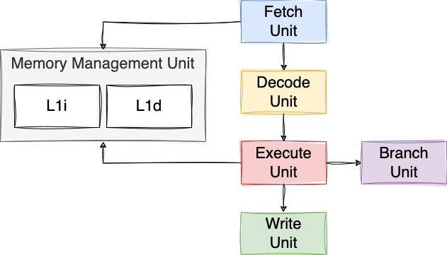

# Majorana

[Majorana](https://en.wikipedia.org/wiki/Ettore_Majorana) is a RISC-V virtual processor written in Go.

## Majorana Virtual Processors (MVP)

- MVP-1: Basic
- MVP-2: L1I
- MVP-3: L1D
- MVP-4: pipelining
- MVP-5: branch target buffer
- MVP-6.0: superscalar processor
- MVP-6.1: forwarding
- MVP-6.2: commit / rollback conditional branches
- MVP-6.3: register renaming
- MVP-7.0: MSI protocol
- MVP-7.1: prevent high-rate of cache line eviction
- MVP-8: L3

### MVP-1

MVP-1 is the first RISC-V virtual machine. It does not implment any of the known CPI optimizations and keep a very simple micro-architecture divided into four stages:

* Fetch: fetch an instruction from the main memory
* Decode: decode the instruction
* Execute: execute the RISC-V instruction
* Write: write-back the result to a register or main memory


### MVP-2

One of the main issues is with MVP-1 is that we need to fetch each instruction from memory. To tackle that, MVP-2 includes a cache for instructions called L1I (Level 1 Instructions) with a size of 64 bytes.


The caching policy is the following: each time the processor meets an instruction that is not present in L1I, it fetches a cache line of 64 bytes from the main memory (a cache line is a contiguous block of memory), and it replaces the existing 64 bytes cache with this new line.

> [!NOTE]  
> Average performance change compared to MVP-1: 80% faster.

### MVP-3

Caching instructions is important; yet, caching data is at least equally important.

MVP-3 introduces a component called Memory Management Unit (MMU). The MMU is the component on top of the existing L1I and a new cache for data: L1D.


When the execute unit wants to access a memory address, it requests it to the MMU that either returns the value directly from L1D or from memory. In the latter case, the MMU fetches a whole cache line of 64 bytes from memory and push that into L1D. The L1D eviction policy is based on LRU (Least-Recently Used). L1D can contain up to blocks of 64 bytes (1 KB).

> [!NOTE]  
> Average performance change compared to MVP-2: 63% faster.

### MVP-4

MVP-4 implements one of the most important optimizations with processors: [pipelining](https://en.wikipedia.org/wiki/Instruction_pipelining).

In a nutshell, pipelining allows keeping every stage as busy as possible. For example, as soon as the fetch unit has fetched an instruction, it will not wait for the instruction to be decoded, executed and written. It will fetch another instruction straight away during the next cycle(s).

This way, the first instruction can be executed in 4 cycles (assuming the fetch is done from L1I), whereas the next instructions will be executed in only 1 cycle.

One of the complexity with pipelining is to handle branches. What if we fetch a [bge](https://msyksphinz-self.github.io/riscv-isadoc/html/rvi.html#bge) instruction for example? The next instruction fetched will not be necessarily the one we should have fetched/decoded/executed/written. As a solution, we implemented the first version of branch prediction handled by the branch unit.



The branch unit takes the hypothesis that a conditional branch will **not** be taken. Hence, after having fetched an instruction, regardless if it's a conditional branch, we will fetch the next instruction after it. If the prediction was wrong, we need to flush the pipeline, revert the program counter to the destination marked by the conditional branch instruction, and continue the execution.

Pipeline flushing has a significant performance penalty as it requires discarding partially completed instruction and restarting the pipeline, leading to wasted cycles.

There is another problem with pipelining. We might face what we call a data hazard. For example:

```asm
addi t1, zero, 2 # Write to t1
div t2, t0, t1   # Read from t1
``` 

The processor must wait for `ADDI` to be executed and to get its result written in T1 before to execute `DIV` (as div depends on T1).
In this case, we implement what we call pipeline interclock by delaying the execution of `DIV`.

> [!NOTE]  
> Average performance change compared to MVP-3: 15% faster.

### MVP-5

One issue with MVP-4 is when it meets an unconditional branches. For example:

```asm
main:
  jal zero, foo    # Branch to foo
  addi t1, t0, 3   # Set t1 to t0 + 3
foo:
  addi t0, zero, 2 # Set t0 to 2
  ...
```

In this case, the fetch unit, after fetching the first line (`jal`), was fetching the second line (first `addi`), which ended up being a problem because the execution is branching to line 3 (second `addi`). It was resolved by flushing the whole pipeline, which is very costly.

The microarchitecture of MVP-4 is very similar to MVP-3, except that the branch unit is now coupled with a Branch Target Buffer (BTB):


One the fetch unit fetches a branch, it doesn't know whether it's a branch; it's the job of the decode unit. Therefore, the fetch unit can't simply say: "_I fetched a branch, I'm going to wait for the execute unit to tell me the next instruction to fetch_".

The workflow is now the following:
- The fetch unit fetches an instruction.
- The decode unit decodes it. If it's a branch, it waits until the execute unit resolves the destination address.
- When the execute unit resolves the target address of the branch, it notifies the branch unit, with the target address.
- Then, the branch unit notifies the fetch unit, which invalidates the latest instruction fetched.

This helps in preventing a full pipeline flush. Facing an unconditional branch now takes only a few cycles to be resolved.

> [!NOTE]  
> Average performance change compared to MVP-4: 1.1% faster.

### MVP-6

#### MVP-6.0

The next step is to implement another very important optimization: superscalar processor. A superscalar processor can execute multiple instructions during a clock cycle by dispatching multiple instructions to different execution units. This is one of the magical things with modern CPUs: even sequential code can be executed in parallel!

The fetch unit and the decode unit are now capable to fetch/decode two instruction within a single cycle. Yet, before to dispatch the executions to the execute units, a new stage comes in: the control unit.


The control unit plays a pivotal role in coordinating the execution of multiple instructions simultaneously. It performs dependency checking between the decoded instructions to guarantee it won't lead to any hazard.

One _small_ issue: MVP-6.0 is not always faster in all the benchmarks. Indeed, when an application is branch-heavy, it performed slightly worst that MVP-5. The main reason being that the control unit logic is very basic and because of that, on average it dispatches less than 0.6 instructions per cycle. Yet, if branches are scarce, it performs significantly better than MVP-5.

Another important consideration, we switched from an L1D, an extremely fast cache to a slower L3 cache. Indeed, an L1 cache is says on-die, meaning integrated directly onto the same silicon die as the processor core. In MVP-6, as we have two cores, it requires solving complex problem related to cache coherency. What if core #1 modifies a memory address in its own L1D that is also read by core #2? We don't solve this problem yet in MVP-6.0 and we move to shared off-die cache; hence a slower one.

> [!NOTE]  
> Average performance change compared to MVP-5: 2.8% faster.

#### MVP-6.1

MVP-6.1 shares the same micro-architecture is the same as MVP-6.0. The only difference lies in the control unit, where we started to implement a new concept called forwarding. Consider a data hazard mentioned previously:

```asm
addi t1, zero, 2 # Write to t1
div t2, t0, t1   # Read from t1
``` 

Instruction 1 writes to `T1`, while instruction 2 reads from `T2`. This is called a read-after-write hazard. Therefore, instruction 2 has to wait for `ADDI` to write the result to `T1` before it gets executed, hence slowing down the execution.

With forwarding, we can alleviate the effects of this problem: the result of the `ADDI` instruction is fed directly back into the EU's input port. `DIV` doesn't have to wait for the execution of `ADDI` to be written in `T1` any more.

> [!NOTE]  
> Average performance change compared to MVP-6.0: 1.6% faster.

#### MVP-6.2

MVP-6.1 was vulnerable to some specific branch conditions tests, somewhat similar to Spectre:

```asm
main:
    lw t0, 0(zero) # memory[0] = 0
    beqz t0, end   # Branch should be taken
    li t1, 1       # Because of speculative instruction this instruction is executed
end:
    ret            # t1 = 1 instead of 0
```

If `beqz` is taken, the next instruction to be executed should be `ret`. With MVP-6.1, not only `li` was executed but the main problem was that register `t1` was modified; leading to an incorrect execution.

To tackle this problem, MVP-6.2 implements a new feature to commit / rollback conditional branches. Indeed, in the previous case, the `li` instruction is executed; yet its result isn't committed unless the branch unit guarantees that the branch was not taken. If the branch isn't taken, the result of `li` is rollbacked.

> [!NOTE]  
> Average performance change compared to MVP-6.1: identical.

#### MVP-6.3

MVP 6.1 tackled only one specific set of hazard problems: read-after-write. Yet, two other hazard types can also occur:

- Write-after-write: make sure the result is the one from the latter instruction
- Write-after-read: make sure the read doesn't use the write result of the next instruction

Both hazards were not handled by the control unit. In one of these two cases, the control unit wasn't dispatching the instruction.

MVP-6.3 deals with these two hazard types using register renaming, an optimization technique that allows multiple logical registers to be mapped to a smaller number of physical registers, enabling more efficient out-of-order execution of instructions.

> [!NOTE]  
> Average performance change compared to MVP-6.2: 34% faster.

### MVP-7

#### MVP-7.0

As we mentioned in MVP-6.0, the first superscalar processor, the cache for data was off-die; hence, slow: L3. MVP-7.0 deals with this problem by implementing the MSI protocol. MSI (Modified, Shared, Invalid) is a cache coherence protocol to manage the consistency of shared memory locations across multiple caches by tracking the state (Modified, Shared, Invalid) of each cache line.

Thanks to the MSI protocol, we can now use again an L1D cache:


One interesting observation, the performance boost compared to MVP-6.3 isn't really the one expected. The problem is the rate of cache line evictions is too important in MVP-7.0. The worst scenario is the following (bear in mind that the MSI protocol allows a single writer):

```
Core #0 wants to write to cache line identified by the memory address 1024
Core #0 writes to its L1D
Core #1 wants to write to cache line identified by the memory address 1024
The cache line in core #0 L1D is evicted
Core #1 writes to its L1D
Core #0 wants to write to cache line identified by the memory address 1024
The cache line in core #1 L1D is evicted
Core #0 writes to its L1D
...
```

In this scenario, each core can only write a single change to their L1D before that this cache line is evicted and fetched by the other core. It's similar to the concept of false sharing, applied to a single thread.

> [!NOTE]  
> Average performance change compared to MVP-6.3: 25% faster.

#### MVP-7.1

MVP-7.1 tackles the problem described in MVP-7.0. Now, when an eviction occurs, the CU wastes an an instruction to sync with the MSI state to know which core is the current reader/writer for each cache line. Instead of distributing blindly an instruction to any available execution unit, it routes the request to a given execution unit.

For example, if core #1 already wrote to the line identified by the memory addresss 1024, the control unit will route this instruction to #1; hence, limiting the number of cache line evictions and write-backs to memory.

> [!NOTE]  
> Average performance change compared to MVP-7.0: 65% faster.

#### MVP-8

In MVP-7.0, we replaced L3 by two L1D, one per core. MVP-8 reintroduces a shared L3 cache:


One of the benefit is that when an updated line has to be written-back, instead of doing it to memory, MVP-8 writes it back to L3 instead. Hence, saving a few precious cycles.

Having two layers of caching for data, L1D and L3, is not straightforward. The strategy chosen was to keep an inclusive cache hierarchy. Said differently, L3 is a superset of L1D. No memory address can be cached in L1D without being cached first in L3. Such a strategy reduces the need for unnecessary write-backs to memory and makes the mental process easier to handle.

> [!NOTE]  
> Average performance change compared to MVP-7.1: 10% faster.

## Benchmarks

All the benchmarks are executed at a fixed CPU clock frequency of 3.2 GHz.

Meanwhile, we have executed a benchmark on an Apple M1 (same CPU clock frequency). This benchmark was on a different micro-architecture, different ISA, etc. is hardly comparable with the MVP benchmarks. Yet, it gives us a reference to show how good (or bad :) the MVP implementations are.

| Machine | Prime number | Sum of array | String copy | String length | Bubble sort | Avg |
|:------:|:-----:|:-----:|:-----:|:-----:|:-----:|:-----:|
| Apple M1 | 31703.0 ns | 1300.0 ns | 3232.0 ns | 3231.0 ns | 42182.0 ns | 1.0 |
| MVP-1 | 24365508 ns, 768.6x slower | 3252967 ns, 2502.3x slower | 10109189 ns, 3127.8x slower | 6131992 ns, 1897.9x slower | 49641410 ns, 1176.8x slower | 1894.7 |
| MVP-2 | 422921 ns, 13.3x slower | 510824 ns, 392.9x slower | 2275302 ns, 704.0x slower | 1235514 ns, 382.4x slower | 13409097 ns, 317.9x slower | 362.1 |
| MVP-3 | 422922 ns, 13.3x slower | 145409 ns, 111.9x slower | 1313097 ns, 406.3x slower | 273310 ns, 84.6x slower | 1993983 ns, 47.3x slower | 132.7 |
| MVP-4 | 141242 ns, 4.5x slower | 108045 ns, 83.1x slower | 1213745 ns, 375.5x slower | 212257 ns, 65.7x slower | 1495782 ns, 35.5x slower | 112.9 |
| MVP-5 | 125594 ns, 4.0x slower | 106765 ns, 82.1x slower | 1204146 ns, 372.6x slower | 209058 ns, 64.7x slower | 1483345 ns, 35.2x slower | 111.7 |
| MVP-6.0 | 125581 ns, 4.0x slower | 104288 ns, 80.2x slower | 1204999 ns, 372.8x slower | 209992 ns, 65.0x slower | 855390 ns, 20.3x slower | 108.5 |
| MVP-6.1 | 109932 ns, 3.5x slower | 100448 ns, 77.3x slower | 1198406 ns, 370.8x slower | 200391 ns, 62.0x slower | 836670 ns, 19.8x slower | 106.7 |
| MVP-6.2 | 109932 ns, 3.5x slower | 100448 ns, 77.3x slower | 1198406 ns, 370.8x slower | 200391 ns, 62.0x slower | 836670 ns, 19.8x slower | 106.7 |
| MVP-6.3 | 94284 ns, 3.0x slower | 100448 ns, 77.3x slower | 611271 ns, 189.1x slower | 200391 ns, 62.0x slower | 836670 ns, 19.8x slower | 70.2 |
| MVP-7.0 | 94286 ns, 3.0x slower | 42893 ns, 33.0x slower | 94688 ns, 29.3x slower | 51136 ns, 15.8x slower | 7572730 ns, 179.5x slower | 52.1 |
| MVP-7.1 | 94286 ns, 3.0x slower | 42893 ns, 33.0x slower | 94688 ns, 29.3x slower | 51136 ns, 15.8x slower | 384364 ns, 9.1x slower | 18.0 |
| MVP-8 | 94332 ns, 3.0x slower | 39463 ns, 30.4x slower | 79578 ns, 24.6x slower | 50118 ns, 15.5x slower | 294985 ns, 7.0x slower | 16.1 |
