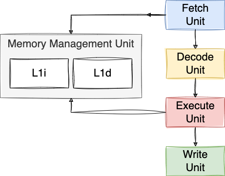

# Majorana

[Majorana](https://en.wikipedia.org/wiki/Ettore_Majorana) is a RISC-V virtual processor written in Go.

## Majorana Virtual Processors (MVP)

### MVP-1

MVP-1 is the first version of the RISC-V virtual machine.
It does not implement any of the known CPU optimizations, such as pipelining, out-of-order execution, multiple execution units, etc.

Here is the microarchitecture, divided into 4 classic stages:
* Fetch: fetch an instruction from the main memory
* Decode: decode the instruction
* Execute: execute the RISC-V instruction
* Write: write-back the result to a register or the main memory


### MVP-2

Compared to MVP-1, we add a cache for instructions called L1I (Level 1 Instructions) with a size of 64 KB. The caching policy is straightforward: as soon as we meet an instruction that is not present in L1I, we fetch a cache line of 64 KB instructions from the main memory, and we cache it into L1I.


### MVP-3

From MVP-3, we introduce a proper memory management unit (MMU). The MMU consists of an 1KB L1I (present from L1I) and a new 1KB L1D to cache data:



When the execute unit wants to access a memory address, it requests it to the MMU that either returns the value directly from L1D or from memory. In the latter case, the MMU fetches a whole cache line of 64 bytes from memory and push that into L1D. L1D eviction policy is based on a LRU cache (Least-Recently Used).

The introduction of an L1D doesn't have any impact for benchmarks not reliant on frequent memory access (obviously); however, it yields significant performance improvements for those that do (up to 40% faster).

### MVP-4

MVP-4 keeps the same microarchitecture as MVP-4 with 4 stages and an MMU. Yet, this version implements [pipelining](https://en.wikipedia.org/wiki/Instruction_pipelining).

In a nutshell, pipelining allows keeping every stage as busy as possible. For example, as soon as the fetch unit has fetched an instruction, it will not wait for the instruction to be decoded, executed and written. It will fetch another instruction straight away during the next cycle(s).

This way, the first instruction can be executed in 4 cycles (assuming the fetch is done from L1I), whereas the next instructions will be executed in only 1 cycle.

One of the complexity with pipelining is to handle branches. What if we fetch a [bge](https://msyksphinz-self.github.io/riscv-isadoc/html/rvi.html#bge) instruction for example? The next instruction fetched will not be necessarily the one we should have fetched/decoded/executed/written. As a solution, we implemented the first version of branch prediction handled by the branch unit.

The branch unit takes the hypothesis that a conditional branch will **not** be taken. Hence, after having fetched an instruction, regardless if it's a conditional branch, we will fetch the next instruction after it. If the prediction was wrong, we need to flush the pipeline, revert the program counter to the destination marked by the conditional branch instruction, and continue the execution.

Pipeline flushing has a significant performance penalty as it requires discarding partially completed instruction and restarting the pipeline, leading to wasted cycles.

There is another problem with pipelining. We might face what we call a data hazard. For example:

```asm
addi t1, zero, 2 # Write to t1
div t2, t0, t1   # Read from t1
``` 

The processor must wait for `ADDI` to be executed and to get its result written in T1 before to execute `DIV` (as div depends on T1).
In this case, we implement what we call pipeline interclock by delaying the execution of `DIV`.


### MVP-5

One issue with MVP-3 is when it met an unconditional branches. For example:

```asm
main:
  jal zero, foo    # Branch to foo
  addi t1, t0, 3   # Set t1 to t0 + 3
foo:
  addi t0, zero, 2 # Set t0 to 2
  ...
```

In this case, the fetch unit, after fetching the first line (`jal`), was fetching the second line (first `addi`), which ended up being a problem because the execution is branching to line 3 (second `addi`). It was resolved by flushing the whole pipeline, which is very costly.

The microarchitecture of MVP-4 is very similar to MVP-3, except that the branch unit is now coupled with a Branch Target Buffer (BTB):


One the fetch unit fetches a branch, it doesn't know whether it's a branch; it's the job of the decode unit. Therefore, the fetch unit can't simply say: "_I fetched a branch, I'm going to wait for the execute unit to tell me the next instruction to fetch_".

The workflow is now the following:
- The fetch unit fetches an instruction.
- The decode unit decodes it. If it's a branch, it waits until the execute unit resolves the destination address.
- When the execute unit resolves the target address of the branch, it notifies the branch unit, with the target address.
- Then, the branch unit notifies the fetch unit, which invalidates the latest instruction fetched.

This helps in preventing a full pipeline flush. Facing an unconditional branch now takes only a few cycles to be resolved.

### MVP-6

#### MVP-6.0

The next step is to implement a so-called superscalar processor. A superscalar processor can execute multiple instructions during a clock cycle by dispatching multiple instructions to different execution units. This is one of the magical things with modern CPUs: even sequential code can be executed in parallel!

The fetch unit and the decode unit are now capable to fetch/decode two instruction within a single cycle. Yet, before to dispatch the executions to the execute units, a new stage comes in: the control unit.


The control unit plays a pivotal role in coordinating the execution of multiple instructions simultaneously. It performs dependency checking between the decoded instructions to guarantee it won't lead to any hazard.

One _small_ issue: MVP-5.0 is not always faster in all the benchmarks. Indeed, when an application is branch-heavy, it performed slightly worst that MVP-4. The main reason being that the control unit logic is very basic and because of that, on average it dispatches less than 0.6 instructions per cycle. Yet, if branches are scarce, it performs significantly better than MVP-4 (~40% in the string copy benchmark).

#### MVP-6.1

For MVP-5.1, the microarchitecture is the same as MVP-5.1. The only difference lies in the control unit, where we started to implement a new concept called forwarding. Consider a data hazard mentioned previously:

```asm
addi t1, zero, 2 # Write to t1
div t2, t0, t1   # Read from t1
``` 

Instruction 1 writes to `T1`, while instruction 2 reads from `T2`. Therefore, instruction 2 has to wait for `ADDI` to write the result to `T1` before it gets executed, hence slowing down the execution. With forwarding, we can alleviate the effects of this problem: the result of the `ADDI` instruction is fed directly back into the ALU's input port. `DIV` doesn't have to wait for the execution of `ADDI` to be written in `T1` anymore.

// TODO

With branch-heavy applications, MVP-5.1 performs the same as MVP-4 (MVP-5.0 was performing worse). With non-branch-heavy applications, MVP-5.1 performs a bit better than MVP-5.0 (about 3% faster).

MVP-5.1 is not a huge revolution, but it's an evolution nonetheless.

## Benchmarks

All the benchmarks are executed at a fixed CPU clock frequency of 3.2 GHz.

Meanwhile, we have executed a benchmark on an Apple M1 (same CPU clock frequency). This benchmark was on a different microarchitecture, different ISA, etc. is hardly comparable with the MVP benchmarks. Yet, it gives us a reference to show how good (or bad :) the MVP implementations are.

| Machine | Prime number | Sum of array | String copy | String length | Bubble sort |
|:------:|:-----:|:-----:|:-----:|:-----:|:-----:|
| Apple M1 | 31703.0 ns | 1300.0 ns | 3232.0 ns | 3231.0 ns | 73.4 ns |
| MVP-1 | 4100053 ns, 129.3% slower | 600402 ns, 461.8% slower | 1820865 ns, 563.4% slower | 1158545 ns, 358.6% slower | 9310172 ns, 126858.9% slower |
| MVP-2 | 266111 ns, 8.4% slower | 162581 ns, 125.1% slower | 572820 ns, 177.2% slower | 377669 ns, 116.9% slower | 3545579 ns, 48311.5% slower |
| MVP-3 | 266111 ns, 8.4% slower | 102916 ns, 79.2% slower | 415625 ns, 128.6% slower | 220475 ns, 68.2% slower | 1680368 ns, 22896.4% slower |
| MVP-4 | 140918 ns, 4.4% slower | 83549 ns, 64.3% slower | 364319 ns, 112.7% slower | 191550 ns, 59.3% slower | 1443855 ns, 19673.7% slower |
| MVP-5 | 125270 ns, 4.0% slower | 82269 ns, 63.3% slower | 354720 ns, 109.8% slower | 188351 ns, 58.3% slower | 1431418 ns, 19504.3% slower |
| MVP-6.0 | 125257 ns, 4.0% slower | 23392 ns, 18.0% slower | 207523 ns, 64.2% slower | 41155 ns, 12.7% slower | 243951 ns, 3324.0% slower |
| MVP-6.1 | 125257 ns, 4.0% slower | 20752 ns, 16.0% slower | 201092 ns, 62.2% slower | 34703 ns, 10.7% slower | 237669 ns, 3238.4% slower |
